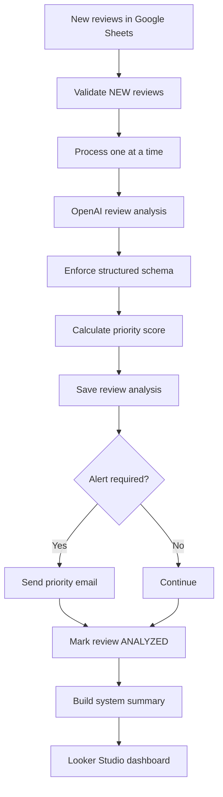

# Amazon Review Intelligence System

An AI-powered review operations workflow built with **n8n, OpenAI, Google Sheets, Gmail, and Looker Studio**. It converts raw Amazon-style customer reviews into structured insights, priority alerts, recommended actions, and decision-ready dashboards.

> Portfolio project by **Qurat ul Ain**. All reviews and product data used in this demonstration are synthetic.

## Business problem

E-commerce teams often receive more customer feedback than they can review manually. Important issues such as damaged packaging, broken safety seals, misleading listing content, or recurring product complaints can be missed or handled too slowly.

This system automates the review-to-action process.

## What the system does

- Reads new reviews from Google Sheets
- Validates required fields and ignores previously analyzed reviews
- Processes reviews one at a time for reliable execution
- Uses an OpenAI model to extract structured customer intelligence
- Classifies sentiment, themes, issues, severity, and responsible teams
- Calculates a priority score and priority level
- Sends Gmail alerts for urgent reviews
- Saves structured analysis back to Google Sheets
- Marks processed reviews as `ANALYZED`
- Produces aggregate intelligence for a Looker Studio dashboard

## Workflow



## Intelligence generated

Each review can produce:

- Sentiment and sentiment score
- Primary customer theme
- Customer issue and positive signal
- Desired improvement
- Severity and responsible team
- Listing and creative opportunities
- Recommended action
- Confidence score
- Priority score and alert decision

## Dashboard

The Looker Studio report contains four decision-focused pages:

1. **Executive Overview** — performance KPIs, sentiment, priority, and filters
2. **Customer Themes** — themes, rating distribution, severity, and responsible teams
3. **Action Centre** — review-level operational queue and recommended actions
4. **Content Opportunities** — listing and creative opportunity distributions

## Technology stack

| Tool | Purpose |
|---|---|
| n8n | Workflow orchestration |
| OpenAI | Review classification and structured analysis |
| Google Sheets | Review input, analysis storage, and summaries |
| Gmail | High-priority review alerts |
| Looker Studio | Interactive reporting dashboard |
| JavaScript | Priority scoring and summary calculations |

## Repository structure

```text
.
├── README.md
├── workflow/
│   └── amazon-review-intelligence-workflow.json
├── sample-data/
│   └── sample-review.json
├── docs/
│   ├── setup-guide.md
│   └── data-schema.md
└── LICENSE
```

## Quick start

1. Download the workflow JSON from the `workflow` folder.
2. Import it into n8n.
3. Replace `YOUR_GOOGLE_SHEET_ID` with your own sheet ID.
4. Replace `alerts@example.com` with your alert recipient.
5. Reconnect Google Sheets, Gmail, and OpenAI credentials.
6. Create the required sheet tabs and columns using the setup guide.
7. Test with one review whose `processing_status` is `NEW`.

See [docs/setup-guide.md](docs/setup-guide.md) for the complete configuration.

## Reliability and privacy

- Credentials and live account references are not included.
- The public workflow is inactive by default.
- Previously analyzed reviews are excluded.
- Required fields and rating ranges are validated.
- Structured output reduces inconsistent AI responses.
- Synthetic data is used for the portfolio demonstration.

## Portfolio value

This project demonstrates AI workflow design, data validation, prompt engineering, structured output, scoring logic, conditional routing, business alerts, analytics, debugging, privacy-aware documentation, and e-commerce domain understanding.

## Author

**Maha**  
 AI automation and product-focused roles.
