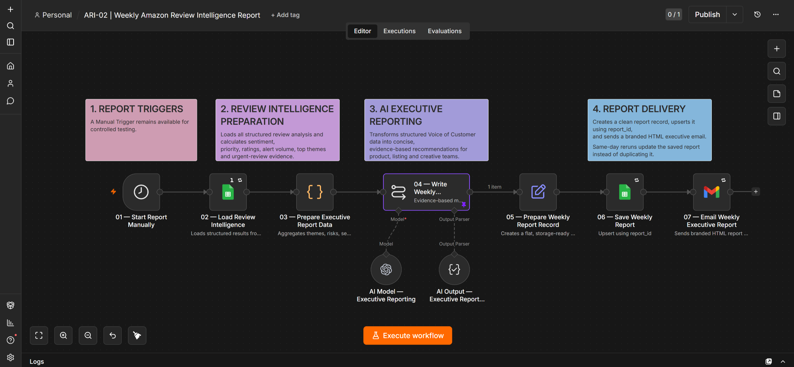
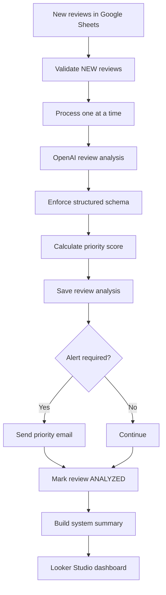
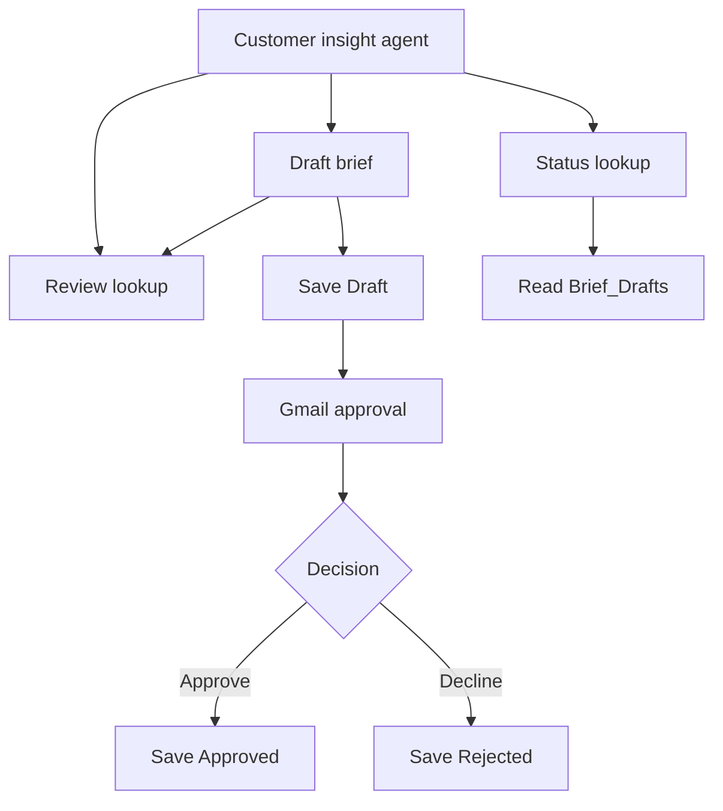
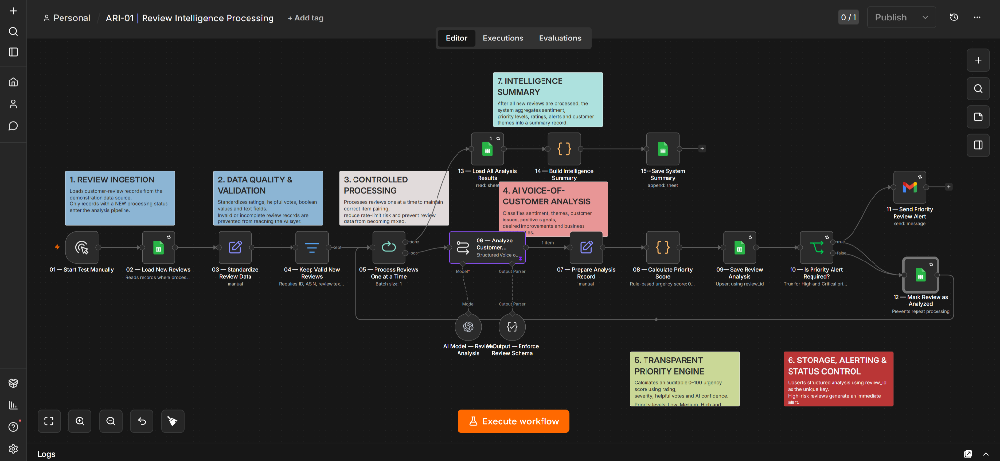

# Amazon Review Intelligence System

An AI-powered review operations workflow built with **n8n, OpenAI, Google Sheets, Gmail, and Looker Studio**. It converts raw Amazon-style customer reviews into structured insights, priority alerts, recommended actions, and decision-ready dashboards.

> Portfolio project by **Qurat ul Ain**. All reviews and product data used in this demonstration are synthetic.

## Business problem

E-commerce teams often receive more customer feedback than they can review manually. Important issues such as damaged packaging, broken safety seals, misleading listing content, or recurring product complaints can be missed or handled too slowly.

This system automates the review-to-action process.

## What the system does

- Reads new reviews from Google Sheets
- Validates required fields and ignores previously analyzed reviews
- Processes reviews one at a time for reliable execution
- Uses an OpenAI model to extract structured customer intelligence
- Classifies sentiment, themes, issues, severity, and responsible teams
- Calculates a priority score and priority level
- Sends Gmail alerts for urgent reviews
- Saves structured analysis back to Google Sheets
- Marks processed reviews as `ANALYZED`
- Produces aggregate intelligence for a Looker Studio dashboard
- Answers ASIN-specific questions using stored review evidence
- Drafts listing and creative briefs with supporting review IDs
- Requests human approval through Gmail and retrieves stored decisions

## Seven-workflow architecture

| Workflow | Purpose | Output |
| --- | --- | --- |
| **ARI-01 — Review Analysis** | Validates and analyzes every new review, calculates urgency, stores structured intelligence, and sends priority alerts. | Review-level intelligence and operational alerts |
| **ARI-02 — Weekly Executive Report** | Aggregates analyzed reviews, calculates weekly metrics, uses AI to write an evidence-based management report, saves it, and emails stakeholders. | Weekly executive summary and recommended actions |
| **ARI-03 — Review Lookup Tool** | Retrieves analyzed reviews for an exact ASIN and packages evidence with review IDs. | ASIN, review count, and matching reviews |
| **ARI-04 — Amazon Customer Insight Agent** | Routes chat requests to review lookup, brief drafting, or status lookup tools. | Evidence-based recommendations and brief status |
| **ARI-05 — Draft Listing Improvement Brief** | Drafts proposed listing and creative changes, saves a Draft record, and starts approval asynchronously. | Saved brief ID and draft text |
| **ARI-06 — Brief Approval** | Sends a Gmail approval request and updates the matching brief after the decision. | Approved or Rejected record |
| **ARI-07 — Brief Status Lookup** | Filters Brief_Drafts by the requested brief_id and returns status or a not-found response. | Stored status with brief ID |

The second workflow uses the structured `Review_Analysis` data produced by the first workflow. This separation allows management reporting to run on its own schedule. ARI-03 through ARI-07 extend the analysis into an interactive, human-reviewed listing improvement process.

### ARI-02 workflow overview



## Workflow



## Human approval demonstration

A synthetic demo used **ASIN B0DEMO001**, **3 analyzed reviews**, and **brief BRIEF-1530**. The collected evidence shows draft creation, a saved Draft record, the approval email, a saved Approved record, and chat retrieval of Approved.


[View the five-stage demonstration and screenshots](docs/approval-demo.md). The rejection branch is configured; it is not demonstrated by these screenshots. The missing-ID test for BRIEF-999999 was reported as passing by the project author, without a screenshot in this evidence set. These are functional portfolio tests, not production performance or sales results.



## Intelligence generated

Each review can produce:

- Sentiment and sentiment score
- Primary customer theme
- Customer issue and positive signal
- Desired improvement
- Severity and responsible team
- Listing and creative opportunities
- Recommended action
- Confidence score
- Priority score and alert decision

## Workflow overview



## Dashboard

The Looker Studio report contains four decision-focused pages:

1. **Executive Overview** — performance KPIs, sentiment, priority, and filters
2. **Customer Themes** — themes, rating distribution, severity, and responsible teams
3. **Action Centre** — review-level operational queue and recommended actions
4. **Content Opportunities** — listing and creative opportunity distributions

## Technology stack

| Tool | Purpose |
|---|---|
| n8n | Workflow orchestration |
| OpenAI | Review classification and structured analysis |
| Google Sheets | Review input, analysis storage, and summaries |
| Gmail | High-priority review alerts |
| Looker Studio | Interactive reporting dashboard |
| JavaScript | Priority scoring and summary calculations |

## Repository structure

```text
.
├── README.md
├── workflow/
│   ├── amazon-review-intelligence-workflow.json
│   ├── 02-weekly-executive-report-workflow.json
│   ├── 03-review-lookup-tool.json
│   ├── 04-amazon-customer-insight-agent.json
│   ├── 05-draft-listing-improvement-brief.json
│   ├── 06-brief-approval.json
│   └── 07-brief-status-lookup.json
├── sample-data/
│   └── sample-review.json
├── docs/
│   ├── setup-guide.md
│   ├── data-schema.md
│   ├── agent-approval-setup.md
│   └── approval-demo.md
└── LICENSE
```

## Quick start

1. Download both workflow JSON files from the `workflow` folder.
2. Import both files into n8n.
3. Replace `YOUR_GOOGLE_SHEET_ID` with your own sheet ID in both workflows.
4. Replace `alerts@example.com` with your alert recipient.
5. Reconnect Google Sheets, Gmail, and OpenAI credentials.
6. Create the required sheet tabs and columns using the setup guide, including `Review_Analysis` and `Weekly_Reports`.
7. Test ARI-01 with one review whose `processing_status` is `NEW`.
8. After analysis data exists, test ARI-02 manually and confirm that it saves and emails the weekly report.

See [docs/setup-guide.md](docs/setup-guide.md) for ARI-01/02 configuration. For the agent and approval extension, follow [docs/agent-approval-setup.md](docs/agent-approval-setup.md), including import order, workflow links, sheet columns, and test steps.

## Reliability and privacy

- Credentials and live account references are not included.
- The public workflow is inactive by default.
- Previously analyzed reviews are excluded.
- Required fields and rating ranges are validated.
- Structured output reduces inconsistent AI responses.
- Synthetic data is used for the portfolio demonstration.

ARI-03 through ARI-07 are sanitized copies of the supplied exports. Credentials, spreadsheet identifiers, deployment webhook IDs, and live workflow references are removed or replaced with placeholders. Reconnect and test them in your own n8n instance. Screenshots are exact crops of the original synthetic demonstration, excluding private browser and account details.

Known limits: ARI-05 has no connected response on its zero-review branch; approval starts asynchronously, so a returned draft does not prove delivery of the approval email. Authentication and delivery errors require operator attention. See the extension setup guide for details.

## Portfolio value

This project demonstrates AI workflow design, data validation, prompt engineering, structured output, scoring logic, conditional routing, business alerts, analytics, debugging, privacy-aware documentation, and e-commerce domain understanding.

## Author

**Qurat ul Ain**  
Visual design, e-commerce creative strategy, and AI workflow automation.

