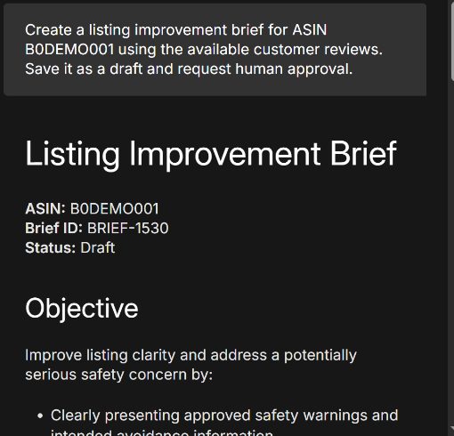
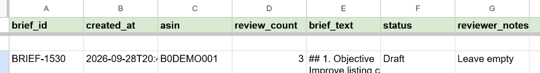
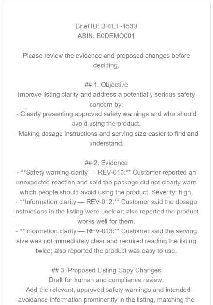
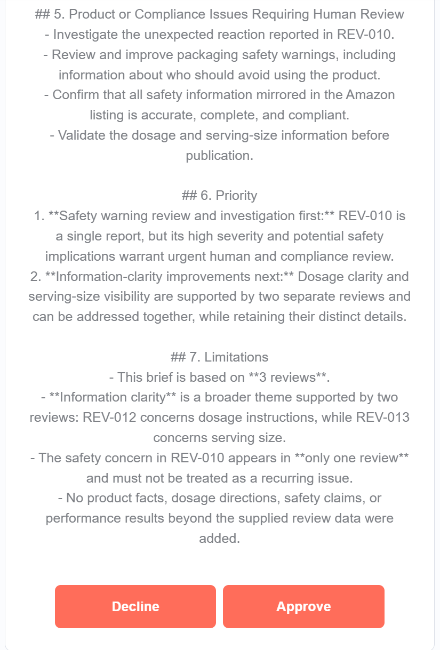
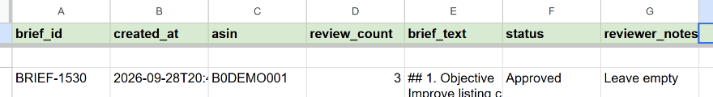
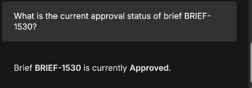

# Human approval demonstration

**Synthetic ASIN:** B0DEMO001 · **Analyzed reviews:** 3 · **Brief:** BRIEF-1530

Original demonstration captured September 28, 2026. Images below are exact crops of supplied screenshots: browser URLs, account headers, desktop chrome, and session identifiers are excluded. No review text, decision, or status has been regenerated.

## 1. Request a listing improvement brief

The ARI-04 chat explicitly requests a brief, draft storage, and human approval. The response identifies BRIEF-1530 with Draft status.

## 2. Confirm the saved Draft

The Brief_Drafts row contains BRIEF-1530, B0DEMO001, review_count 3, and Draft status. The visible brief text is truncated by the original column width.

## 3. Review the approval email

The email body identifies the same brief and ASIN and cites REV-010, REV-012, and REV-013. The lower portion provides Decline and Approve buttons and states the evidence limitations. A safety concern appears in one review; the information-clarity theme is supported by two reviews. Severity and frequency are distinguished.

## 4. Confirm the stored decision

The same brief row changes to Approved.

## 5. Retrieve the status through chat

The user asks for BRIEF-1530's current approval status. The agent returns Approved, matching the stored row.

## Validation scope

| Check | Evidence |
| --- | --- |
| Draft request and generated ID | Screenshot |
| Draft saved with 3 reviews | Screenshot |
| Approval email and decision buttons | Two screenshots |
| Same record updated to Approved | Screenshot |
| Approved status retrieved through chat | Screenshot |
| BRIEF-999999 not found | Reported as passing by author; no screenshot included |
| Decline updates Rejected | Configured branch; not demonstrated in this evidence set |
| Fresh import of sanitized exports | JSON structure and connection checks only; no live execution |

The original exported routing and prompts are preserved. This functional demonstration does not establish production reliability, review accuracy, sales uplift, or time savings. The system prepares proposed changes for human review; it does not publish Amazon listing changes.
